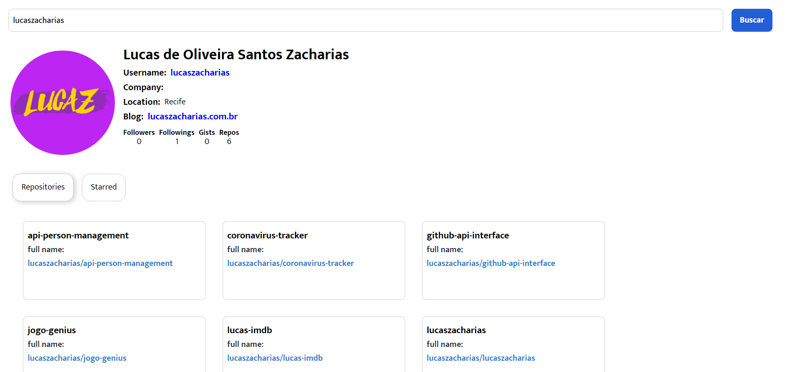

# GitHub API Interface 

## About project

This project was created utilizing reusable components in React. I created an interface for GitHub's API using React while following along the Eduzz Fullstack bootcamp hosted on DIO.

### Features

- Search infos by username
- Search repo by username
- Search starred repos by username

### Preview

Print of the finished project.

### Libraries used

- [axios](https://www.npmjs.com/package/axios)
- [react-tabs](https://www.npmjs.com/package/react-tabs)
- [styled-components](https://styled-components.com/)

## See it working

you can access the link below to access the application:

### `https://github-interface-api.herokuapp.com/`

